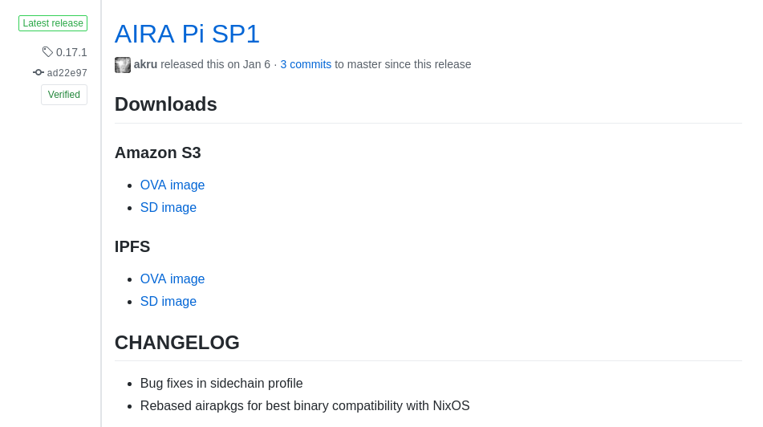

Overview
--------

{: .logo}

AIRA (Autonomous Intelligent Robot Agent) project implements the standard of economic interaction between human-robot and robot-robot via liability smart contract. AIRA makes it possible to connect a variety of different robots to the market of robots' liabilities existing on Ethereum for the direct sale of data from robot sensors, ordering of logistics services, and organization ordering of personalized products at fully automated enterprises.

Useful links 
------------

* [AIRA's official site](https://aira.life/)
* [The Team](https://aira.life/team)
* [Robonomics Network](https://robonomics.network/en/)


Quick Start
-----------

The first thing to do is to get the last image of AIRA. You can find one [here](https://github.com/airalab/aira/releases).



AIRA's distributed as virtual machine image. To launch the client you need to import .ova file to VirtualBox. There's a convenient `Ctrl+I` shortcut.

It's recommended to set:

* RAM to 2Gb at least
* Network to Bridge

When the image is imported, launch the machine. Wait some time until Ethereum node is fully synchronized and AIRA client is ready to work!
AIRA creates a new address for you, it's located here:

```
/var/lib/parity/foundation-env.sh
```

Or you can call a service:
```
rosservice call /lighthouse/xrt/accounts
```

if you need to export an account, .json file is in `/var/lib/parity/.local/share/io.parity.ethereum/keys/` directory.

Some helpful commands can be found on [cheatsheet](cheats.md) page.

At this point there's not a lot we can do. For example we can listen to `/lighthouse/infochan/incoming/ask`:

```
rostopic echo /lighthouse/infochan/incoming/ask
```


